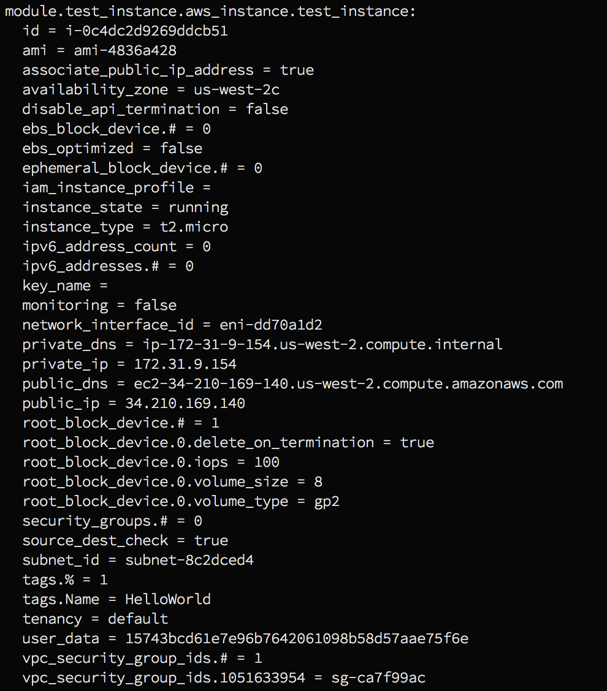

# Terraform Repo For Learnin' Gud

### Contents

**terraform/**
└ README.md
└ **modules/**
&nbsp;&nbsp;&nbsp;&nbsp; └ main.tf
&nbsp;&nbsp;&nbsp;&nbsp; └ variables.tf
└ **ec2_example/**
&nbsp;&nbsp;&nbsp;&nbsp; └ main.tf

**`modules/main.tf`**
This is the configuration file for modules that can be used in this example. Resources declared in this file can be instantiated within *`ec2_example/main.tf`*.

**`modules/variables.tf`**
This file outlines input parameters that must be defined when instantiating resources from the desired module.

**`ec2_example/main.tf`**
This is the configuration file for provisioning a stack with terraform. In it's current state, this file will create a single ec2 instance.

### USAGE

1. Clone this repo

2. Initialize your local terraform with the remote state file in S3
`terraform init`

3. Locally establish configurations for the modules used in *modules/main.tf*
`terraform get`

4. You should be able to effectively run
`terraform plan`
and
`terraform apply`

After running the `plan` command, you should see:

This indicates a successful plan of the terraform configuration. And, after running the `apply` command, use `terraform show` to display the remote state file for this stack. It should display something similar to this:

Viewing the remote state file in this manner will give you information about the instance that terraform spins up for you.

### CREDENTIALS & PROFILES

The latest version of terraform supports profile configurations within your *`~/.aws/config`* file. This example uses my profile named **sandbox** to spin up instances. If you don't have a profile named **sandox** in your config file, set the profile in the *provider* stanza of *`ec2_example/main.tf`* to reflect the correct profile.

### ERRORS

A. If your aws profile is not configured correctly, you will see this error:

Check your *`~/.aws/credentials`* and *`~/.aws/config`* files. Then check the profile reference in the *`ec2_modules/main.tf`* file.

B. If you haven't instantiated the module locally, you'll see this error:

Run the `terrafrom get` command in *`ec2_example/`* to import the module files into that directory.

C. If you haven't established the backend configurations for this terraform project, you will see this error:

Run *`terraform init`* to locally establish the backend connection to the state file in S3.

***

##### README WIP sections

If you make changes to the module, you must commit those changes, push them to the master branch, and run `terraform get -update`. This will update the module configuration in your terraform cache to reflect the changes you made.
